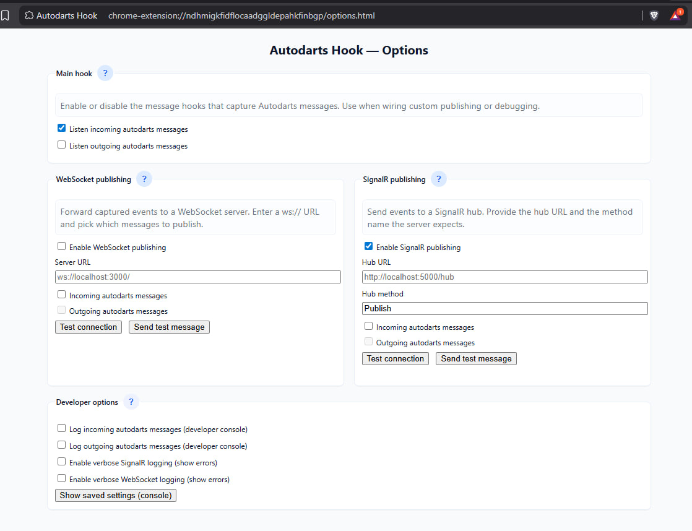

# Autodarts Hook

## How it works
- Content script (`content.js`) is injected into matching pages and inserts `autodarts-capture.js` into the page context.
- `autodarts-capture.js` patches the `MessageEvent.prototype.data` getter and `WebSocket.prototype.send` to dispatch `autodarts-incoming` and `autodarts-outgoing` events on the `window`.
- The content script listens for those events and logs the `event.detail` to the console.

## How to load locally
1. Open Chrome and go to `chrome://extensions`
2. Enable "Developer mode"
3. Click "Load unpacked" and select this folder
4. Open the page you want to observe (for example `https://play.autodarts.io/`) and open DevTools (F12) -> Console. 
You should see logs from the extension if activated.
If you want console logs enable in the options

## Options
 - "Listen incoming" / "Listen outgoing" control whether the extension attaches its message listeners for incoming/outgoing websocket events.
 - "Log incoming" / "Log outgoing" control whether captured messages are written to the developer console (useful for debugging).
 - Channel filtering has been removed from the extension. All captured messages are forwarded to configured publishers; consumers should perform any filtering they need.

## SignalR publishing
 - The extension can optionally publish captured websocket messages to a SignalR hub. In the Options page you'll find a "SignalR publishing" section where you can:
    - Enable/disable SignalR publishing
    - Configure the Hub URL
    - Set the Hub method name the extension will invoke for each message
    - Toggle publishing for incoming and/or outgoing messages independently   

## WebSocket publishing
 - Publish captured messages to a plain WebSocket server (useful for local clients).
 - The Options page includes a "WebSocket publishing" section where you can:
     - Enable/disable WebSocket publishing
     - Configure a WebSocket URL (e.g. `ws://localhost:3000/`)
     - Toggle publishing for incoming and/or outgoing messages independently
     - Test the connection and send a test message to verify the server receives relayed events
